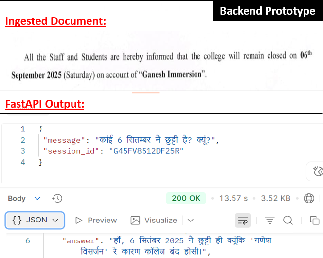

# 🧠 RAG-Powered Multilingual FAQ Chatbot

An intelligent, language-agnostic chatbot powered by a Retrieval-Augmented Generation (RAG) framework.  
It extracts, indexes, and retrieves information from multiple document formats (PDFs, images, DOCX, PPTX) and provides contextual, multilingual responses through an interactive chat interface.

---

## 🚀 Features

- **Multilingual Understanding** – Responds in English, Hindi, Telugu, Marwari, Dhundhari, or any regional language.
- **Context-Aware Conversations** – Maintains chat context using session-based management (no login required).
- **Universal Document Ingestion** – Automatically extracts content from PDFs, images, and Office files using OCR.
- **RAG-Based Query Processing** – Combines Qdrant vector search with Gemini for accurate, context-driven responses.
- **Data Security** – AES encryption and MongoDB for secure storage of chat and document metadata.
- **Simple Integration** – Backend built with FastAPI and easily connectable with web or chat interfaces via APIs.

---

## 🧩 Tech Stack

| Component | Technology |
|------------|-------------|
| **Frontend** | React.js (Widget Integration Ready) |
| **Backend** | FastAPI (Python) |
| **Database** | MongoDB |
| **Vector DB** | Qdrant |
| **Embedding Model** | `BAAI/bge-small-en-v1.5` |
| **LLM Model** | `Gemini-2.5-flash` |
| **OCR Engine** | Gemini Vision OCR |
| **Other Tools** | LangChain, Sentence Transformers, PyMuPDF, FPDF |

---

## ⚙️ Architecture Overview

```bash
Data Ingestion → Data Extraction → Data Vectorization → Semantic Search → Context Retrieval → Answer Generation
```

*Figure: High-level architecture of the chatbot pipeline.*

1. **Upload documents** – PDFs, images, PPTX, DOCX.  
2. **Extract & chunk text** – Handled using OCR + text splitters.  
3. **Store embeddings** – Indexed in Qdrant with metadata.  
4. **Query handling** – User messages are translated into contextual English.  
5. **RAG pipeline** – Retrieves most relevant document chunks.  
6. **Response generation** – Gemini LLM formulates language-matched answers.

---

## 🧠 Core API Endpoints

| Endpoint | Method | Description |
|-----------|--------|-------------|
| `/upload` | `POST` | Upload and process a document into Qdrant |
| `/chat` | `POST` | Send a message and get contextual AI response |
| `/files` | `GET` | List all uploaded file names |
| `/delete/{filename}` | `DELETE` | Remove document and associated data |

---

## 📦 Setup Instructions

### 1️⃣ Clone Repository

```bash
git clone https://github.com/your-username/multilingual-faq-chatbot.git
cd multilingual-faq-chatbot
```

### 2️⃣ Create Virtual Environment

```bash
python -m venv venv
source venv/bin/activate   # or venv\Scripts\activate on Windows
```

### 3️⃣ Install Dependencies

```bash
pip install -r requirements.txt
```

### 4️⃣ Configure Environment Variables

Replace placeholders in `app.py` and `doc_processor.py` with your credentials:

```bash
GEMINI_API_KEY = "<your-gemini-api-key>"
QDRANT_API_KEY = "<your-qdrant-api-key>"
QDRANT_URL = "<your-qdrant-url>"
MONGO_URI = "<your-mongo-uri>"
```

### 5️⃣ Run the Server

```bash
uvicorn app:app --reload
```

server runs at 👉 http://127.0.0.1:8000

---

## 🧩 Example Usage

### Upload a file:

```bash
curl -X POST -F "file=@sample.pdf" http://127.0.0.1:8000/upload
```

### Ask a question:

```bash
curl -X POST http://127.0.0.1:8000/chat \
     -H "Content-Type: application/json" \
     -d '{"message": "<your-question-accoridng-to-the document-uploaded>", "session_id": "1234"}'
```

---

## 🖼️ Sample Working

Here’s a glimpse of the chatbot in action 👇


*Figure: Sample query and response flow in the chatbot.*

---

## 📊 Benefits

- Reduces repetitive query handling for institutions.
- Improves accessibility via regional language support.
- Works efficiently in low-network environments.
- Easy to integrate and scale across platforms (Web, WhatsApp, Telegram, etc.).
